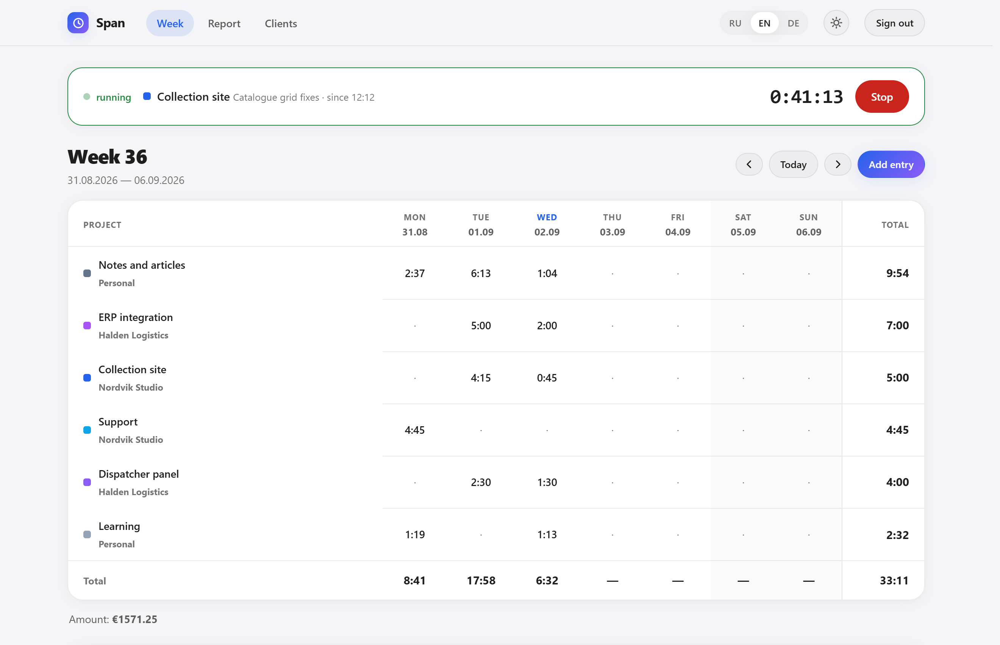
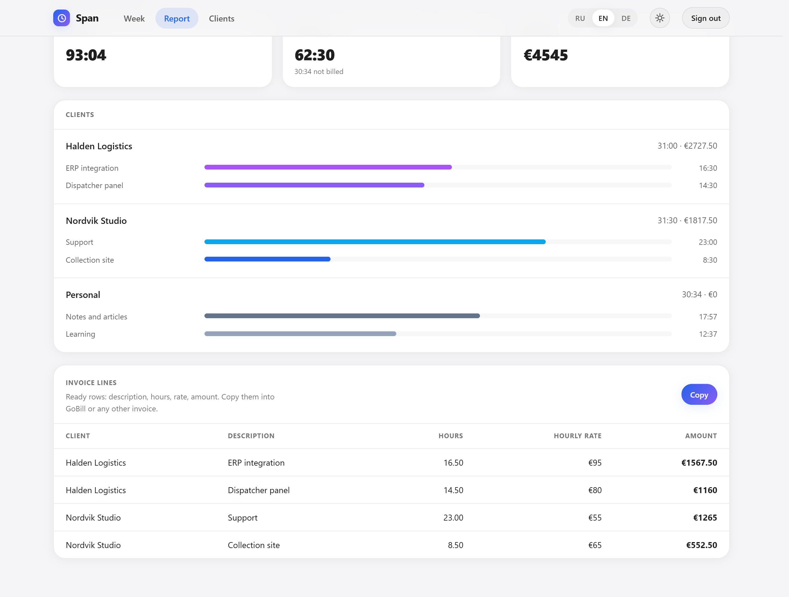

<div align="center">

# Span

**Selbst gehostete Zeiterfassung, die in einer Rechnung endet**

Eine Woche ist ein Raster, kein Feed. Timer mit einem Klick starten, sehen, wohin die Woche ging, und den Monat in Rechnungspositionen verwandeln.

[](https://go.dev)
[](LICENSE)
[](Dockerfile)

[English](README.md) · [Русский](README.ru.md)

</div>

---

## Warum

Zwischen einem Notizblock mit Stunden und einer betrieblichen Zeitwirtschaft gibt es nichts für eine einzelne Person: Cloud-Tracker wollen ein Abo und ein Konto pro Kopf, betriebliche Systeme eine Einführung.

Span macht genau eine Sache vollständig: vom Druck auf **Start** bis zu fertigen Zeilen für die Rechnung. Es kennt den Satz, die Rundungsregel und die Tatsache, dass ein Teil der Arbeit nicht abrechenbar ist.

## Funktionen

- **Wochenraster** — Projekte untereinander, Tage nebeneinander, Summen an beiden Rändern. Ein leerer Donnerstag ist so sichtbar wie ein voller Dienstag
- **Nur ein laufender Timer** — ein neuer Start stoppt den vorherigen; parallele Timer erfinden Stunden, die es nie gab
- **Rundung pro Kunde** — minutengenau oder auf 5 / 10 / 15 / 30 Minuten aufgerundet, wie vereinbart
- **Satz beim Kunden, Ausnahme beim Projekt** — Korrekturen nach altem Vertrag können weniger kosten als neue Arbeit
- **Abrechenbar und nicht** — interne Calls und eigene Fehler bleiben im Bericht und aus der Rechnung heraus
- **Rechnungspositionen** — eine Zeile pro Projekt: Beschreibung, Stunden, Satz, Betrag. Direkt in [GoBill](https://github.com/dripips/gobill) kopierbar
- **CSV-Export** — derselbe Zeitraum, eine Zeile pro Eintrag
- **Drei Sprachen** — Deutsch, Englisch, Russisch
- **Helles und dunkles Thema** — der laufende Timer wird durch Form und Beschriftung markiert, nie nur durch Farbe
- **Eine Binärdatei** — Go und SQLite, keine externen Dienste
- **Demodaten** — ein Befehl füllt zwei Wochen eines plausiblen Freelancer-Monats

## Schnellstart

```bash
git clone https://github.com/dripips/span.git
cd span
go build -o span .
./span
```

[http://localhost:8080](http://localhost:8080) öffnen — das Eigentümerkonto entsteht beim ersten Start aus `-email` / `-password` (Standard `you@example.com` / `span`).

### Docker

```bash
docker compose up -d
```

### Mit Demodaten ausprobieren

```bash
go run ./cmd/seed -db ./span.db
```

Drei Kunden, sechs Projekte, zwei Wochen Einträge und ein bereits laufender Timer.

## Wie es funktioniert

Beim **Kunden** liegen Satz, Währung und Rundungsregel. Ein **Projekt** gehört zu einem Kunden und darf den Satz überschreiben. Ein **Eintrag** ist eine Zeitspanne auf einem Projekt, standardmäßig abrechenbar.

Die Dauer wird beim Lesen berechnet, nicht gespeichert: `ceil(Minuten / Schritt) * Schritt`, wobei der Schritt vom Kunden kommt. Ändert sich die Rundungsregel, rechnet auch der letzte Monat neu — genau so gemeint, denn die Regel gehört zur Vereinbarung, nicht zum Eintrag.

Der Bericht gruppiert nach Kunde und Projekt, `InvoiceLines` faltet die abrechenbaren Einträge zu einer Zeile pro Projekt. Nicht abrechenbare Zeit ist im Bericht sichtbar und in den Positionen konstruktionsbedingt nicht vorhanden.

## Konfiguration

| Flag | Umgebung | Standard | Bedeutung |
|---|---|---|---|
| `-addr` | `SPAN_ADDR` | `:8080` | Listen-Adresse |
| `-db` | `SPAN_DB` | `span.db` | SQLite-Datei |
| `-email` | `SPAN_EMAIL` | `you@example.com` | Eigentümerkonto, nur beim ersten Start |
| `-password` | `SPAN_PASSWORD` | `span` | Passwort, nur beim ersten Start |

Der Sitzungsschlüssel wird beim ersten Start erzeugt und in der Datenbank abgelegt — nach einem Neustart bleibt man angemeldet.

## Stack

Go 1.26 · [chi](https://github.com/go-chi/chi) · [modernc.org/sqlite](https://gitlab.com/cznic/sqlite) (reines Go, ohne cgo) · `html/template` · handgeschriebenes CSS, kein Frontend-Framework.

Das Designsystem steht in [DESIGN.md](DESIGN.md), der Produktkontext in [PRODUCT.md](PRODUCT.md).

## Screenshots

| Woche | Bericht |
|---|---|
|  |  |

## Lizenz

MIT — siehe [LICENSE](LICENSE).
